## lambda

### 函数编程演化历程

1. 将业务逻辑直接写死在代码里
2. 将单一维度的条件作为参数传入方法中，方法内根据参数进行业务逻辑实现
3. 将多个维度的条件作为参数传入方法中，业务实现需要根据不同的参数处理不同逻辑
4. 将业务逻辑封装为一个实体类，方法接受实体类为参数，方法内部调用实体类的处理逻辑
5. 调用方法时不再创建实体类，而是使用匿名函数的形式替代
6. 使用 Lambda 表达式替代匿名函数的形式作为方法的参数，真正实现判断逻辑参数化传递

### 如何判断属于哪类方法引用？

如何区分 `Integer::doubleValue` 是静态方法引用还是任意类型实例方法引用？

因为静态方法引用和任意类型实例方法引用都是使用 `类名::方法名` 的形式来表示，所以分辨的方法就是看方法是否为 static 就可以了。

现有对象的实例方法引用都是使用的 `对象::方法名` 的形式来表示，所以比较好区分。

### 函数式接口

- 接口中只有一个抽象方法
- Java8 的函数式接口注解：`@FunctionInterface`
- 函数式接口的抽象方法签名：函数描述符

### 常用函数接口及使用

| 接口 | 参数 | 返回类型 | 描述 |
|---|---|---|---|
| Predicate<T> | T | boolean | 用于判别一个对象。比如求一个人是否为男性 |
| Consumer<T> | T | void | 用于接收一个对象进行处理但没有返回，比如接收一个人并打印他的名字 |
| Function<T, R> | T | R | 转换一个对象为不同类型的对象 |
| Supplier<T> | None | T | 提供一个对象 |
| UnaryOperator<T> | T | T | 接收对象并返回同类型的对象 |
| BinaryOperator<T> | (T, T) | T | 接收两个同类型的对象，并返回一个原类型对象 |

### 方法引用

- 指向静态方法的方法引用 `Integer::parseInt`
- 指向任意类型实例方法的方法引用 `String::length`
- 指向现有对象实例方法的方法引用 `stringBuilder::append`

## stream

### 流（数据源->中间操作->终端操作）操作分类

- 中间操作
  - 无状态操作：filter、map、flatMap、peek
  - 有状态操作：distinct、skip、limit、sorted
- 终端操作
  - 非短路操作：forEach、reduce、max、min、collect、count
  - 短路操作：allMatch、anyMatch、noneMatch、findFirst、findAny

### 流的构建

- 由值创建流
- 由数组创建流
- 由文件生成流
- 由函数生成流（无限流）

### 预定义收集器功能

- 将流元素归约和汇总为一个值
- 将流元素分组
- 将流元素分区

## 资源回收

### 垃圾回收（GC）的特点

- 垃圾回收机制只负责回收堆内存资源，不会回收任何物理资源
- 程序无法精确控制垃圾回收动作的具体发生时间
- 在垃圾回收之前，总会先调用它的 finalize 方法

### 常见需手动释放的物理资源

- 文件/流资源
- 套接字资源
- 数据库连接资源

### TWR 使用

- 多资源自动关闭
- 实现 AutoCloseable 接口
- 避免异常屏蔽

### 资源关闭顺序问题

- 先开后关原则
- 从外到内原则
- 底层资源单独声明原则

### 资源关闭特殊情况

- 资源对象被 return，由调用方关闭
- ByteArrayInputStream 等不需要检查关闭的资源对象
- 使用 Socket 获取的 InputStream 和 OutputStream 不需要关闭（会导致整个 socket 关闭，应该调用 shutdownInput 和 shutdownOutput）

## Guava

### 不可变对象的优点

- 当对象被不可信的库调用时，不可变形式是安全的
- 不可变对象被多个线程调用时，不存在竞态条件问题
- 不可变集合不需要考虑变化，因此可以节省时间和空间
- 不可变对象因为有固定不变，可以作为常量来安全使用

### 不可变集合的三种创建方式

- copyOf 方法：ImmutableSet.copyOf(set)
- of 方法：ImmutableSet.of("a", "b", "c")
- Builder 工具：ImmutableSet.builder().build()

### Multiset 两种视角

#### 没有元素顺序限制的 ArrayList<E>

- add(E)：添加单个给定元素
- iterator()：返回一个迭代器，包含 Multiset 所有元素（包括重复元素）
- size()：返回所有元素的总个数（包括重复元素）

#### Map<E, Integer> 键为元素，值为计数

- count(Object)：返回给定元素的计数
- entrySet()：返回 Set<Multiset.Entry<E>> 和 Map 的 entrySet 类似
- elementSet()：返回所有不重复元素的 Set<E> 和 Map 的 keySet 类似

### Multiset 与 Map 的区别

- 元素计数只能是正数
- multiset.size() 返回集合大小（包括重复元素）
- multiset.iterator() 会迭代重复元素
- multiset 支持直接设置元素的计数
- 没有的元素 multiset.count(E) 为 0

### 多种 Multiset 的实现

- HashMultiset
- TreeMultiset
- LinkedHashMultiset
- ConcurrentHashMultiset
- ImmutableMultiset

### 对字节流/字符流提供的工具方法

- ByteStreams：提供对 InputStream/OutputStream 的操作
- CharStreams：提供对 Reader/Writer 的操作

### 对源（Source）和汇（Sink）的抽象

- 源是可读的：ByteSource/CharSource
- 汇是可写的：ByteSink/CharSink

## 线程池

### 线程池的核心参数

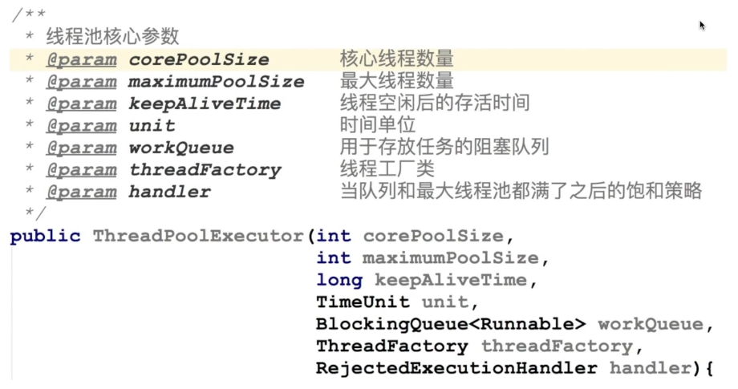

### 线程池的处理流程

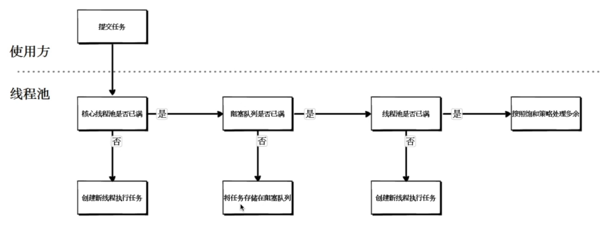

### 线程池可选择的阻塞队列

- 无界队列
- 有界队列
- 同步移交队列

### 线程池可选择的饱和策略

- AbortPolicy 终止策略（默认）
- DiscardPolicy 抛弃策略
- DiscardOldestPolicy 抛弃旧任务策略
- CallerRunsPolicy 调用者运行策略

### 线程池的执行示意图

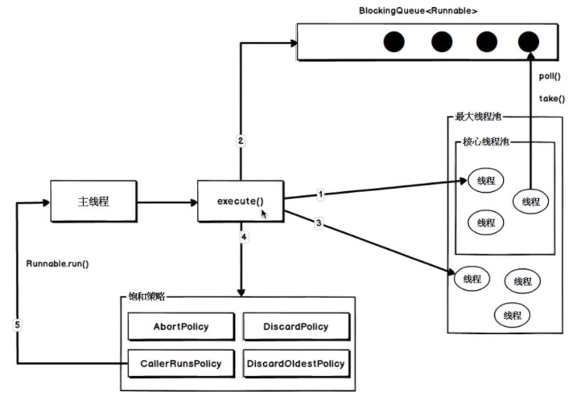

### 常用线程池

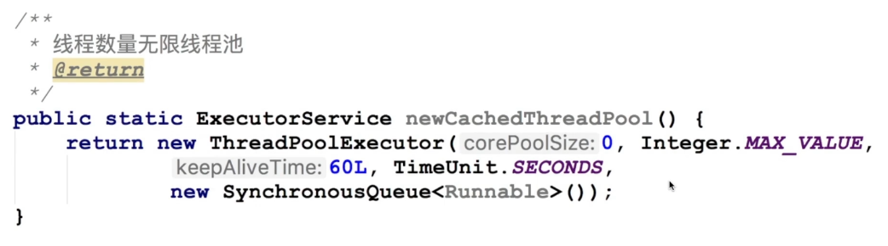

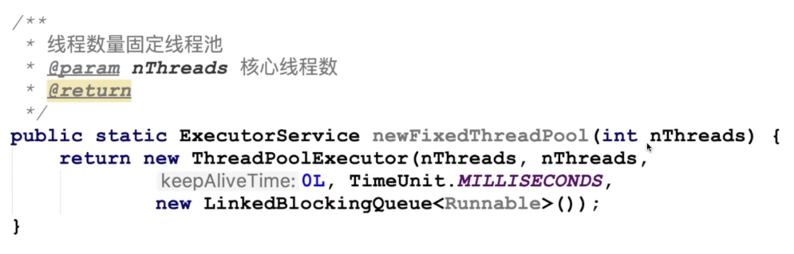

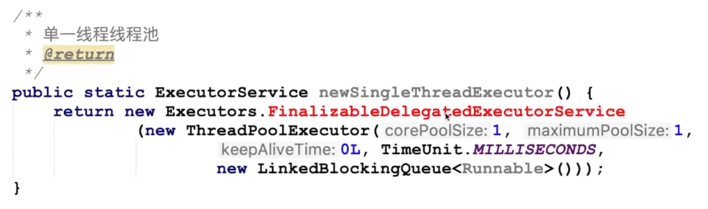

### 线程池的状态

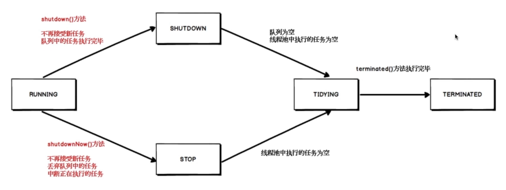

## lombok

### Lombok 实现原理

注解的两种解析方式

- 运行时解析
- 编译时解析

编译时解析的两种机制

- Annotation Processing Tool（注解处理器）
- Pluggable Annotation Processing API（JSR269 插入式注解处理器）

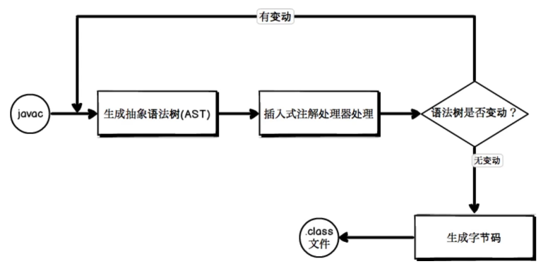

### Lombok 常用注解

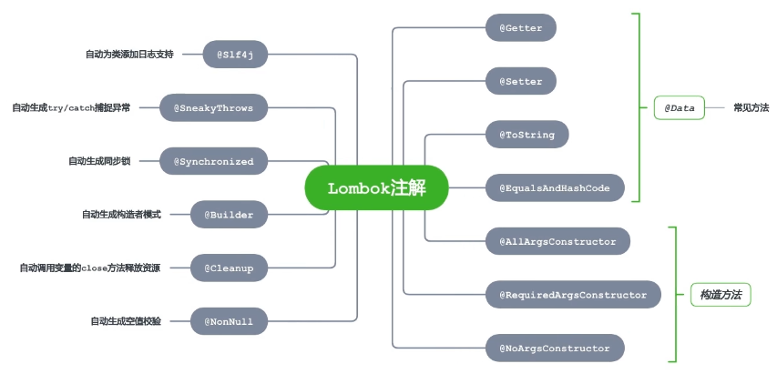

### Lombok 的优点

- 通过注解自动生成样板代码，提高开发效率
- 代码简洁，只关注相关属性
- 新增属性后，无需刻意修改相关方法

### Lombok 的缺点

- 降低了源代码的可读性和完整性
- 加大对问题排查的难度
- 需要 IDE 相关插件的支持

## 验证框架

### 分层验证模型与 JavaBean 验证模型

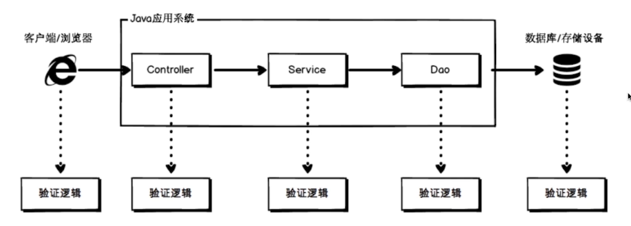

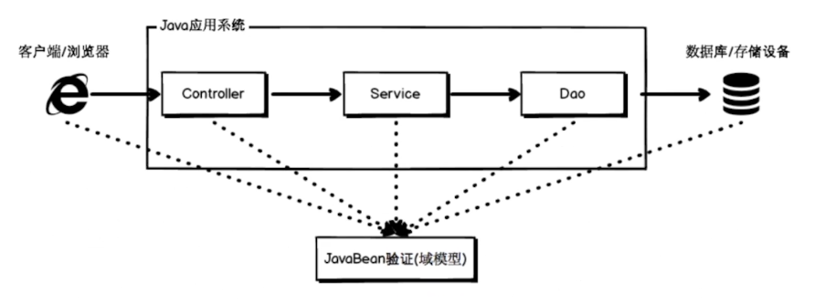

### 常用约束注解

- 空值校验类：@Null、@NotNull、@NotEmpty、@NotBlank 等
- 范围校验类：@Min、@Size、@Digits、@Future、@Negative 等
- 其他校验类：@Email、@URL、@AssertTrue、@Pattern 等

## IDEA

### 单文件编辑

1. 导包（option/alt + enter）
2. 递进选择（command/ctrl + w）
3. 复制行（command/ctrl + d）
4. 删除行（command/ctrl + y）
5. 大小写切换（command/ctrl + shift + u）
6. 展开/折叠（command/ctrl + shift + -/+）
7. Live Template
8. Postfix

### 多文件编辑 - 跳转

1. 项目之间跳转（option/alt + command/ctrl + [或]）
2. 最近打开文件列表（command/ctrl + e）
3. 最近修改文件之间跳转（command/ctrl + shift + e）
4. 最近浏览文件之间跳转（option/alt + command/ctrl + 左右箭头）
5. 利用书签跳转（command/ctrl + F11）

### 多文件编辑 - 搜索

1. 类搜索（command/ctrl + n）
2. 文件搜索（command/ctrl + shift + n）
3. 符号搜索（option/alt + command/ctrl + shift + n）
4. 全局搜索（command/ctrl + shift + f）

### 断点调试

1. 添加断点（command/ctrl + F8）
2. 单步运行（F8）
3. 跳过此断点（F9）
4. 查看所有断点（command/ctrl + shift + F8）
5. 禁止所有断点
6. 添加条件断点
7. 表达式求值（option/alt + F8）

### 常用插件

1. Stream 调试工具：Java Stream Debugger（默认集成）
2. 快捷键提供工具：Key promoter X
3. 代码注解插件：Lombok
4. Mybatis 工具：Free Mybatis plugin
5. Maven 辅助神器：Maven Helper
6. 单元测试生成工具：JUnitGenerator V2.0
7. JSON 转领域对象工具：GsonFormat
8. 领域对象转 JSON 工具：POJO to JSON
9. 序列化版本 ID 生成器：GenerateSerialVersionUID
10. 驼峰转换：CamelCase（option/alt + shift + u）
11. 生成对象 set 方法：GenerateAllSetter
12. 可执行 SQL：Mybatis Log Plugin

## 检查工具

### 主流 Java 静态分析工具

1. CheckStyle：检查源文件，主要关注格式
2. FindBugs：基于 Bug Patterns 概念，检查 .class 文件中的潜在 Bug
3. PMD：基于静态规则集，检查源文件中的潜在问题
4. P3C：阿里编码规约，代码规范

### SonarQube

1. 通过插件机制，可以集成不同测试/分析/集成工具
2. 通过量化的方式度量代码质量的变化，从而进行代码质量管理
3. 提供接口支持，可以方便的在持续集成中使用